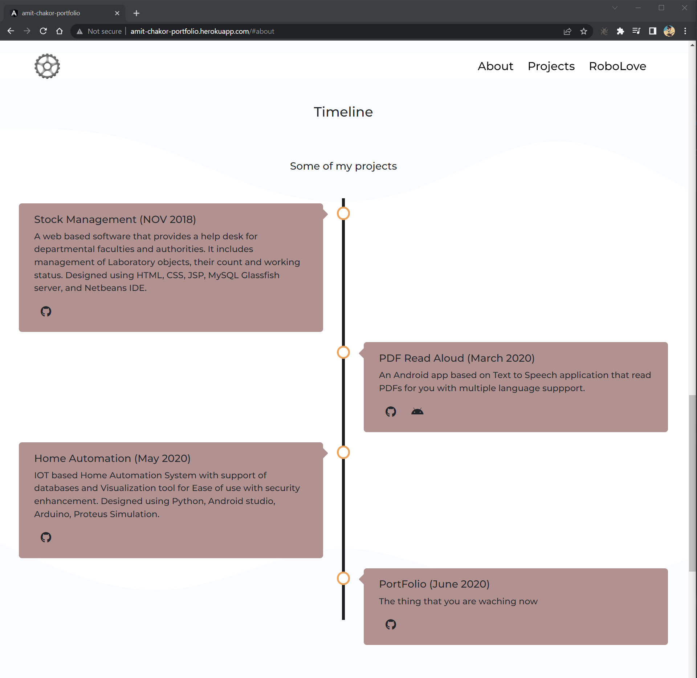

# Amit Chakor Portfolio

My old portfolio based on AngularJS

Thought it never made to the production, but I got to learn CSS and Javascript

The project is made with HTML, CSS, AngularJs, Bootstrap

## Screens

